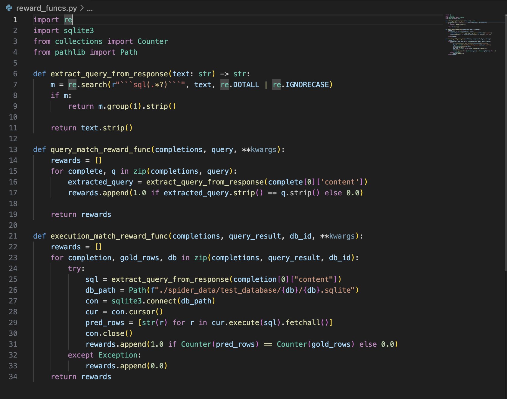
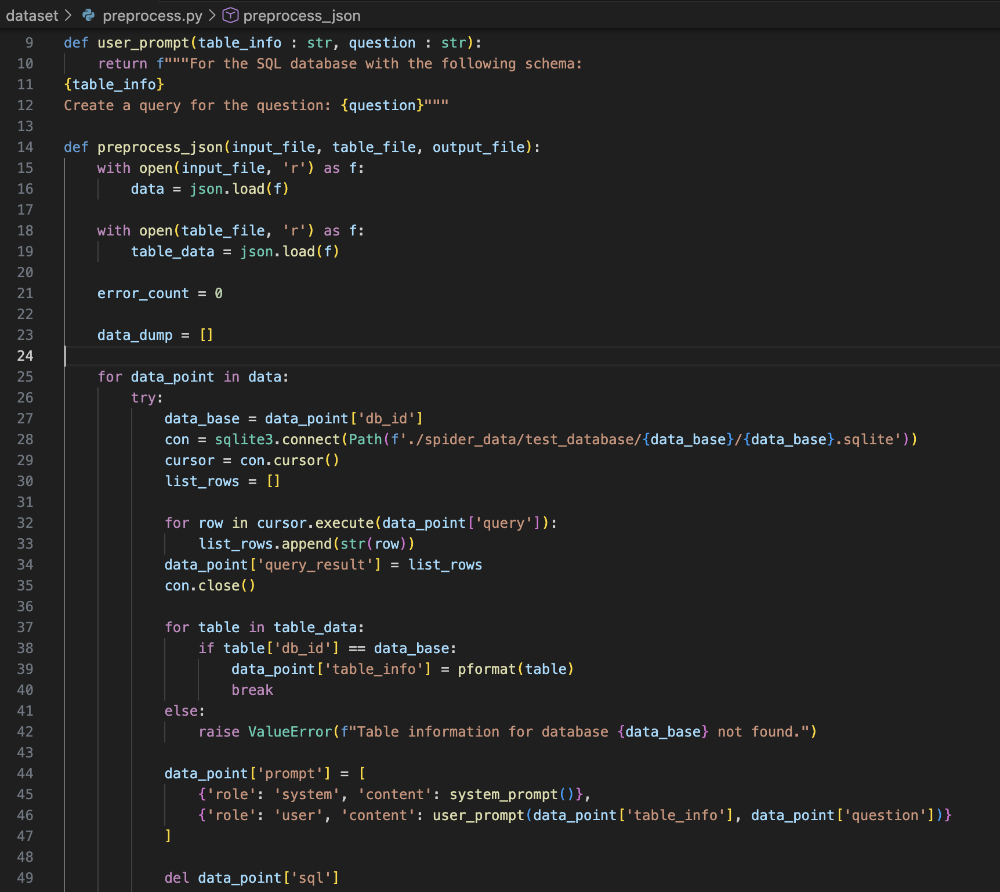

Source code: https://github.com/ianbryant2/cs175-project-code
Website code: https://github.com/jaydentrannnn/LLM-RL4SQL

Reports:

- [Proposal](proposal.html)
- [Status](status.html)
- [Final](final.html)

Welcome to this website. 

## Summary of the Project
Our project explores how reinforcement learning can improve text-to-SQL systems by training models to turn natural language questions and database schemas into executable SQL queries. We use GRPO with verifiable rewards to compare baseline models against RL fine-tuned versions, and we study how different reward designs affect reasoning quality, accuracy, and generalization. To measure our performance, we evaluate on benchmark datasets like Spider using execution accuracy and exact match, with the goal of making SQL generation more reliable on complex, messy data.

## Datasets
Our project uses the Spider (Semantic Parsing with Pre-trained Models) dataset. It is a large-scale, cross-domain text-to-SQL dataset released in 2018 by researchers at Yale and Salesforce.

It is designed to test generalization across databases, not just memorization of query patterns.

Github link: https://github.com/taoyds/spider?utm_source=chatgpt.com
Website link: https://yale-lily.github.io/spider?utm_source=chatgpt.com

## Code screenshots
A screenshot of some of our reward functions (query match, and evaluation match):  
  

How we preprocess our SQL data:  
  

